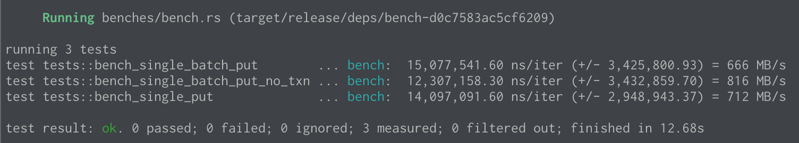

# rocksdb_transactiondb

Playground to test various rocksdb assumptions.

TODO:

- what are the file implications of doing a destrot on a transaction vs a rollback?
- reorg tests with a macro: https://github.com/BurntSushi/fst/blob/master/src/raw/tests.rs#L111-L158
